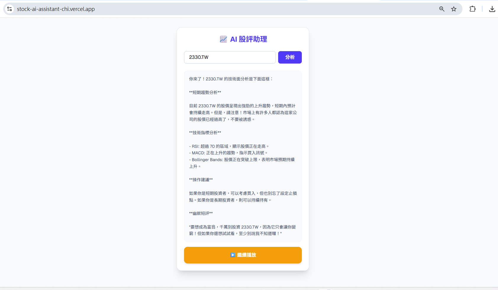

# AI 股評助理 Taiwan Stock AI Assistant

> 整合 **Next.js 15**、**Llama 3.1 LLM** 與 **Groq 高速推理引擎** 的即時台股分析工具。  
> 輸入台股代號，即可在 **< 1 秒**內獲得專業 AI 分析報告，並支援語音朗讀互動。

🔗 **Live Demo：** https://stock-ai-assistant-chi.vercel.app

---

## 畫面預覽




---

## 核心特色

| 特色 | 說明 |
|------|------|
| ⚡ 極速 AI 回應 | 採用 Groq LPU 推理技術，回應時間穩定低於 1 秒 |
| 🔊 智慧語音互動 | 整合 Web Speech API 實現 TTS，動態 UI 顏色同步播放狀態 |
| 🔒 安全性實踐 | API Key 嚴格透過 Environment Variables 控管，從不暴露於前端 |
| 📱 響應式設計 | Tailwind CSS 打造完美適配手機與桌機的介面 |
| 🚀 自動化部署 | Vercel CI/CD，每次 push 自動上線 |

---

## 技術架構

```
使用者輸入股票代號
       ↓
Next.js App Router（前端 UI）
       ↓
Next.js API Route（後端，保護 API Key）
       ↓
Groq API → Llama 3.1 8B（LLM 推理 < 1 秒）
       ↓
回傳分析報告 → Web Speech API 語音朗讀
```

## Tech Stack

- **Framework**：Next.js 15（App Router）
- **Language**：TypeScript
- **Styling**：Tailwind CSS
- **AI Model**：Llama 3.1 8B via Groq Cloud
- **Deployment**：Vercel（含 CI/CD）

---

## 本地開發

**1. Clone 專案**

```bash
git clone https://github.com/wei920605/stock-ai-assistant.git
cd stock-ai-assistant
```

**2. 安裝依賴**

```bash
npm install
```

**3. 建立環境變數**

在根目錄建立 `.env.local`：

```
GROQ_API_KEY=你的_GROQ_API_金鑰
```

> Groq API Key 可於 https://console.groq.com 免費申請

**4. 啟動開發伺服器**

```bash
npm run dev
```

開啟 http://localhost:3000 即可使用。

---

## 技術亮點與挑戰

**後端 API Route 封裝**

API Key 不經過前端，所有 Groq 請求透過 Next.js API Route 處理，防止金鑰外洩。這也是為何選擇 Next.js 全端架構而非純前端方案的核心原因。

**Prompt Engineering**

系統 Prompt 設計為「專業股市分析師」人設，針對台股語境優化輸出格式，確保回應結構一致且易讀。同時處理 prompt injection 等安全風險。

**Web Speech API 相容性**

克服不同瀏覽器間 TTS 行為差異，透過狀態機邏輯（idle → speaking → paused）設計直觀的 UI 視覺回饋，避免使用者感知到底層的 API 不一致。

---

## 開發者

**黃正瑋**  
📧 wei20030605@gmail.com  
🔗 https://github.com/wei920605
